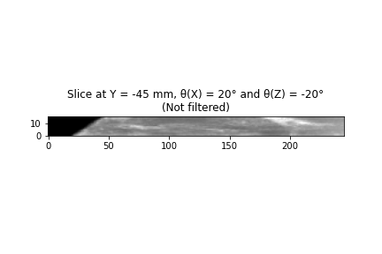

<h1 align="center"><strong>Bilateral Filtering on Resliced Images and in 3D, Implementation and Comparison</strong></h1>

**Abstract.** Medical images usually require post-processing to view relevant anatomies or draw conclusions from them. A clinician may want to bilateral filter and view non-orthogonal slices of a 3D medical image in diagnosing a condition. This can be directly achieved in Python with the use of external libraries; however, the currently available libraries are not best fitted for this purpose. In this paper, we explore implementing re-slicing and non-linear filtering algorithms in Python ourselves. We analyse the impact of filtering the whole 3D image before getting a slice versus 2D filtering a single slice. It was found that 2D filtering after slicing filtered to a greater extent, approximately 20 % more compared to 3D filtering. In addition, medium-frequency noise was removed, and edges were enhanced by 8 % and 6 %, respectively. As well as applying more filtering, 2D filtering took less time, with run times of the order of seconds as to minutes in 3D. Parallelising the 3D filtering computation improved performance but still give minute-long run times. Furthermore, slicing and then 2D filtering appeared to slightly warp the image, although not significantly. Therefore, we would recommend 2D filtering after slicing in clinical cases where a fast diagnosis is required. 

<h2><strong>1.&emsp;&ensp;Introduction</strong></h2>

Slicing 3D medical images is crucially important when a clinician wants to get underlying views of an anatomical structure. Particularly, the clinician may want to view non-orthogonal slices of the volume: this may be due to the image acquired at an angle, patient inclination, or just the need to further explore the region of interest. Obtaining orthogonal planes from a 3D image saved as a numpy array in Python is quite simple; however, getting these planes slightly tilted requires interpolation and importing additional libraries. In this paper, we will attempt to implement the aforementioned slicing, transforming the whole volume.

<strong>&nbsp;&nbsp;&nbsp;&nbsp;</strong>In addition, we will explore filtering the image volume both in 2D and 3D. Medical images often come with unwanted high-frequency noise which makes it harder to view desired anatomies [1]. This notably reduces their diagnostic value; specifically, images acquired with ultrasound come with speckle noise [2]. Hence, it is essential to low-pass filter these images, whilst still preserving the edges of important structures. Bilateral filtering can be used to apply a Gaussian filter without blurring edges, as described by C. Tomasi [3]. The currently available bilateral filtering algorithms of well-known Python libraries are those by SimpleITK and OpenCV. The SimpleITK one can bilateral filter in 3D, but is considerably slow; on the contrary, the OpenCV one is very fast but only works in 2D. We will try to achieve a bilateral filter that works in 3D.

<h2><strong>2.&emsp;&ensp;Methods / Implemented algorithms</strong></h2>
<h3><strong>2.1&emsp;&ensp;&nbsp;Re-slicing in a non-orthogonal plane</strong></h3>

Reasonable positioning parameters that a clinician may want to use for non-orthogonal glimpses are views in the x, y, and z axis, with translations as large as the image volume and rotations up to 45° in each dimension. The function `utils.slice_at` in the code implements the re-slicing algorithm, first, by warping the image volume with the above parameters and then, taking a centre slice of it. The reason for the 45° angle is so that slices from different axes don’t overlap each other, and information is not lost during interpolation. In addition, translation was restricted to the axis of view for simplicity.  

<strong>&nbsp;&nbsp;&nbsp;&nbsp;</strong>If one was to take a z-slice, for example, the algorithm would build a rigid transformation matrix, composed of a z-only translation vector and a rotation matrix, and warp the volume with it. Then it would return the view of the transformed volume at the xy-plane in the middle: this corresponds to slicing the volume at a chosen location (represented by the translation) and angle (represented by the rotation). The volume warping was done through the `scipy.interpolate.interpn` function. A new function `utils.show_slice` was then made for visualising the images in 2D and 3D. Figures 1 and A.1 show re-sliced examples as obtained using the two built functions, with varying positioning values.

<table align="center">
  <tr>
    <th>
      

      

    </th>
    <th>
      

      

    </th>
  </tr>
</table>

<strong>Fig. 1:</strong>  Slices obtained from a sample 3D ultrasound image using different positioning parameters [4].

<h3><strong>2.2&emsp;&ensp;&nbsp;Bilateral filtering</strong></h3>

In order to employ a bilateral filter in 3D and 2D, the `scipy.ndimage.generic _filter` function was utilised. A Gaussian kernel was first built and then fed into scipy’s filter along with a previously defined bilateral filtering function. The `bilateral_filter` function in the `utils` module applies the filtering by:

1. <strong>&nbsp;&nbsp;&nbsp;&nbsp;</strong>Constructing an intensity kernel the same size as the Gaussian.
2. <strong>&nbsp;&nbsp;&nbsp;&nbsp;</strong>Element-wise multiplication of both kernels to get a bilateral kernel.
3. <strong>&nbsp;&nbsp;&nbsp;&nbsp;</strong>Multiplying with data window and normalising to get the output value (as described in C. Tomasi) [3].

Since `scipy.ndimage.generic_filter` uses a flattened filter kernel (although kernel size must be explicitly defined), it could be used both for the 2D and 3D versions. 

<strong>&nbsp;&nbsp;&nbsp;&nbsp;</strong>For the 3D filtering case, a 3D Gaussian kernel was built and inputted into the algorithm along with the ultrasound image volume. To find the equivalent 2D filtering, if one was to slice the original image and then filter it, the previous 3D Gaussian was sliced with the chosen positioning (rotation) parameters. This gave the equivalent 2D Gaussian (see Figure A.2). The 2D Gaussian kernel and slice were then put into the algorithm to obtain a filtered 2D counterpart image. Examples of 3D filtering before re-slicing and 2D filtering after re-slicing can be seen in Figure 2.

<strong>&nbsp;&nbsp;&nbsp;&nbsp;</strong>Possible bilateral filtering parameters are the kernel size, the geometric spread (σd) and the photometric spread (σr). σd determines the spread of the Gaussian filter and hence the degree of low-pass filtering. σr sets by how much one wants to combine different voxel values: in other words, if the difference between voxels is much smaller than σr, then they are mixed. On the other hand, if the voxel intensity differences are larger than σr, the voxels are not mixed. Finally, the kernel size controls the influence spatially distant voxels have on each other during filtering.

<h2><strong>3.&emsp;&ensp;Experiments</strong></h2>

To quantify the difference between the 3D and 2D approaches, the voxel-level intensity differences were computed for the original, un-filtered slice. The mean and standard deviation (s.d.) of the intensity differences were then obtained and proportionally compared. These metrics are important as they tell how much the images have been filtered. A larger mean difference may suggest that the image is blurrier while a larger s.d. difference convey the edges are sharper. If the relative difference between the means and s.d.s is significant, then one might consider selecting one filtering approach over the other.

<strong>&nbsp;&nbsp;&nbsp;&nbsp;</strong>In addition, we attempted to acquire and compare the frequency information within the filtered slices. To get the average images’ spectrum, their centred Fourier Transform was obtained with `numpy.fft` and the respective radial profile was calculated. The spectrum was then split into three components to analyse the impact at low, medium and high frequencies. This analysis is important as it reveals how well the bilateral filter removes medium-frequency speckle noise whilst still preserving high-frequency edges [2].

<h2><strong>3.&emsp;&ensp;Results and Discussion</strong></h2>

Visually, it seems like the 3D-filtered slice is less blurry than the 2D-filtered one. However, the 2D-filtered slice seems to have more defined, contrasting structure edges. In addition, a slight change in the position of some anatomies can be seen in the 2D-filtered slice. This additional warping may be associated with the interpolation performed to get the non-orthogonal slice. The mean and s.d. of the intensity differences for the 2D-filtered image are 22 % and 19.5 % larger than those for the 3D-filtered: these make sense as the 2D-filtered image appears to be blurrier and sharper. Furthermore, the 2D-filtered slice has 0.1962 % less low-frequency, 8.882 % less medium-frequency and 6.052 % more high-frequency components than the 3D-filtered one (see Figure A.3). These correlate with the observations above where the speckle noise in 2D-filtering is further removed and the main edges become steeper.

<table align="center">
  <tr>
    <th>
      
    </th>
    <th>
      
    </th>
  </tr>
</table>

<strong>Fig. 2:</strong> Visualisation of 3D filtering before slicing (left) and 2D filtering after slicing (right)

<strong>&nbsp;&nbsp;&nbsp;&nbsp;</strong>As σd increases, the image becomes blurrier, as broader Gaussians make neighbouring pixels affect each other to a greater extent. Increasing σr also makes the image blurrier, as pixels which are not that similar are averaged together. In addition, large kernel sizes make the image less sharp as pixels are being averaged with more pixels. In terms of computational performance, our implementation is faster than SimpleITK’s, with a run time of 18:01 for the given volume. We aimed to decrease the run time even further by splitting the 3D image and parallelising the filtering. This was done using Python’s `Pool` functionality, which applied the filtering function to each image part using different CPU cores in parallel. For our case, we split and ran the filtering in 3 cores, which reduced execution time to 8:01.

<h2><strong>4.&emsp;&ensp;Conclusion</strong></h2>

To conclude, we implemented re-slicing and fast bilateral filter algorithms using popular Python libraries. 2D filtering after slicing increased the degree of bilateral filtering and was faster than 3D filtering, but slightly warped the slice. A clinician may consider 2D filtering after re-slicing if time is valuable in the diagnosis of a patient. Otherwise, 3D filtering can be used for more representative images. One could also explore the use of `cython` and more parallelised filtering to accelerate the code. While the paper only focused on comparing a single slice of a single volume, more slices of more 3D images could be analysed: this will allow one to draw more accurate and significant conclusions.

<h2><strong>5.&emsp;&ensp;Appendix</strong></h2>

<table align="center">
  <tr>
    <th>
      
    </th>
    <th>
      
    </th>
  </tr>
</table>

<strong>Fig. A.1:</strong> Additional slices obtained from the sample 3D ultrasound image [4].

<strong>Fig. A.2:</strong> View of sliced 3D gaussian kernel (2D equivalent).

<strong>Fig. A.3:</strong> Average frequency spectra for un-filtered, 3D-filtered, and 2D-filtered slices.

<h2><strong>6.&emsp;&ensp;References</strong></h2>

[1]&nbsp;&nbsp;&nbsp;&nbsp;Morin R, Mahesh M. Role of Noise in Medical Imaging. Journal of the American College of Radiology 2018;15:1309. https://doi.org/10.1016/J.JACR.2018.07.003. 
[2]&nbsp;&nbsp;&nbsp;&nbsp;Michailovich O v., Tannenbaum A. Despeckling of Medical Ultrasound Images. IEEE Trans Ultrason Ferroelectr Freq Control 2006;53:64. https://doi.org/10.1109/TUFFC.2006.1588392. 
[3]&nbsp;&nbsp;&nbsp;&nbsp;Tomasi C, Manduchi R. Bilateral filtering for gray and color images. Proceedings of the IEEE International Conference on Computer Vision 1998:839–46. https://doi.org/10.1109/ICCV.1998.710815.
[4]&nbsp;&nbsp;&nbsp;&nbsp;Prostate_US_Example - Ultrasound, General - embodi3D.com n.d. https://www.embodi3d.com/files/file/45742-prostate_us_example/ (accessed June 18, 2023).

<!--
[Example 1 2D]: ./slice_z0_angle_x-4_y0_z0_not_fld.png
[Example 1 3D]: ./slices_z0_angle_x-4_y0_z0_not_fld.png
[Example 2 2D]: ./slice_y-45_angle_x20_z-20_not_fld.png
[Example 2 3D]: ./slices_y-45_angle_x20_z-20_not_fld.png
[Example 1 2D Filtered 2D]: ./slice_z0_angle_x-4_y0_z0_2d_fld.png
[Example 1 2D Filtered 3D]: ./slice_z0_angle_x-4_y0_z0_3d_fld.png
[Example 3 2D]: ./slice_x-70_angle_y45_not_fld.png
[Example 3 3D]: ./slices_x-70_angle_y45_not_fld.png
[Sliced Gaussian]: ./sliced-gaussian.png
[Average Spectra]: ./average-spectra.png
[Test]: https://myoctocat.com/assets/images/base-octocat.svg
-->
